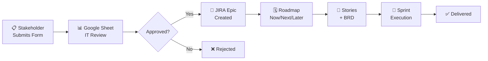

<div align="center">

# 🚀 PMO Automation System

### *Transform chaos into clarity with end-to-end program management automation*

[](COMPLETED_PHASE1.md)
[](FULL_PMO_ROADMAP.md)
[](https://nksaidev.atlassian.net)
[](https://script.google.com)

**From stakeholder request → roadmap → scoping → sprint execution**

[📋 Quick Start](#-quick-start) • [📚 Documentation](#-documentation) • [🗺️ Roadmap](#-roadmap) • [🎯 Use Cases](#-use-cases)

---

</div>

## ⚡ At a Glance

Transform your PMO process from **manual chaos** to **automated clarity**:

| Before | After |
|--------|-------|
| 🐌 15 min to create Epic in JIRA | ⚡ 10 seconds automated |
| 📝 Manual data entry (error-prone) | 🎯 100% data accuracy |
| 📧 Email threads for status | 🔔 Auto-notifications |
| 📊 Weekly manual reports | 📈 Real-time dashboards |
| ❓ "Where's my request?" | 🔍 Full visibility from intake to delivery |

---

## 🎬 How It Works



---

## ✨ What's Included

### 🟢 Phase 1: Epic Intake Automation (LIVE)

<table>
<tr>
<td width="50%">

**📥 Automated Intake**
- Google Form for stakeholders
- One-click Epic creation
- Auto-populated fields
- Zero manual entry

</td>
<td width="50%">

**🔄 Smart Sync**
- Sheet → JIRA one-way sync
- Priority auto-mapping (P0→Highest)
- Request Type field population
- Labels: Effort + Quarter

</td>
</tr>
<tr>
<td width="50%">

**🛡️ BRD Gate**
- Blocks transitions without BRD
- Railway middleware validation
- Ensures dev-ready Stories
- Zero incomplete requirements

</td>
<td width="50%">

**📊 Real Data**
- 4 production Epics created
- 100% data accuracy
- 5 min intake (down from 15)
- Live in production today

</td>
</tr>
</table>

**🔗 Production Links:**
- 📝 [Intake Form](https://forms.gle/w3nfUnipveyAhxss5) - Submit requests
- 📊 [Review Sheet](https://docs.google.com/spreadsheets/d/158zDAbms5TR7rIJeTfG6o9FpMDlz3AY2HpYqcizLVtQ/edit) - IT assessment
- 🎫 [JIRA Project](https://nksaidev.atlassian.net/jira/software/projects/PGMAUTO) - Track work
- 🚦 [BRD Gate](https://pm-automation-system-production.up.railway.app) - Validation service

---

### 🔵 Phase 2: Epic Workflow & Roadmap (PLANNED Q3 2026)

<details>
<summary><b>Click to expand roadmap features</b></summary>

**Epic Lifecycle Management**
```
📥 INTAKE → 🔍 UNDER_REVIEW → 📦 BACKLOG → 🗓️ IN_ROADMAP → 🏃 IN_EXECUTION → ✅ COMPLETED
```

**Key Features:**
- 🗺️ **Roadmap Board** - Visual Now/Next/Later by quarter
- 📊 **Capacity Planning** - Team capacity vs. committed work
- 🤖 **Auto-Prioritization** - Business value × complexity scoring
- 🔔 **Stakeholder Notifications** - Automated status updates
- 📈 **Utilization Tracking** - Alert at >80% capacity

**Timeline:** 2 weeks | **Effort:** 5 days

</details>

---

### 🟣 Phase 3: Story-Level BRD Workflow (PLANNED Q3-Q4 2026)

<details>
<summary><b>Click to expand scoping features</b></summary>

**Story Lifecycle**
```
📝 TO_DO → ✍️ BRD_IN_PROGRESS → 👀 BRD_REVIEW → ✅ READY_FOR_DEV → 🔨 IN_PROGRESS → ✔️ DONE
```

**Key Features:**
- 📋 **Story Templates** - Auto-populated User Story, Acceptance Criteria
- 🛡️ **Definition of Ready** - Checklist before sprint commitment
- 🔍 **Enhanced BRD Gate** - Tech Lead approval required
- 🎯 **READY_FOR_DEV Status** - Clear signal for sprint planning
- 📎 **Mockup Attachments** - Design links + screenshots

**Timeline:** 3 weeks | **Effort:** 7 days

</details>

---

### 🟠 Phase 4: Sprint Execution & Metrics (PLANNED Q4 2026)

<details>
<summary><b>Click to expand sprint automation features</b></summary>

**Sprint Automation**
- 🤖 **Auto-Populate Backlog** - Pull READY_FOR_DEV Stories by priority
- 💬 **Slack Daily Standup** - Automated progress summaries (8 AM)
- 📉 **Burndown Charts** - Real-time with at-risk alerts
- 📊 **Velocity Tracking** - Team performance trends
- 📧 **Sprint Reviews** - Auto-generated reports to stakeholders
- 🎯 **Metrics Dashboard** - Epic progress, roadmap status, cycle time

**Timeline:** 4 weeks | **Effort:** 10 days

</details>

---

## 🚀 Quick Start

### ⚡ 30-Minute Setup (Phase 1)

```bash
# 1. Clone the repo
git clone https://github.com/PlainJane20/pm-automation-system.git
cd pm-automation-system

# 2. Follow the setup guide
open SETUP_INSTRUCTIONS.md
```

**Setup Steps:**
1. ✅ Create JIRA project + Request Type field (5 min)
2. ✅ Deploy Google Form + Sheet (10 min)
3. ✅ Install Google Apps Script (10 min)
4. ✅ Test Epic creation (5 min)

**📖 Full Guide:** [SETUP_INSTRUCTIONS.md](SETUP_INSTRUCTIONS.md)

---

## 📚 Documentation

<table>
<tr>
<th>Document</th>
<th>Purpose</th>
<th>Audience</th>
</tr>
<tr>
<td>📘 <a href="README.md"><b>README</b></a></td>
<td>Project overview & quick start</td>
<td>Everyone</td>
</tr>
<tr>
<td>🗺️ <a href="FULL_PMO_ROADMAP.md"><b>Full PMO Roadmap</b></a></td>
<td>Complete Phases 1-4 vision</td>
<td>Leadership, Contributors</td>
</tr>
<tr>
<td>✅ <a href="COMPLETED_PHASE1.md"><b>Phase 1 Complete</b></a></td>
<td>What we built (architecture, workflows)</td>
<td>Implementers, Maintainers</td>
</tr>
<tr>
<td>🛠️ <a href="SETUP_INSTRUCTIONS.md"><b>Setup Instructions</b></a></td>
<td>30-minute deployment guide</td>
<td>IT Admins, DevOps</td>
</tr>
<tr>
<td>🏗️ <a href="SYSTEM_SUMMARY.md"><b>System Summary</b></a></td>
<td>Technical architecture details</td>
<td>Engineers, Architects</td>
</tr>
<tr>
<td>📋 <a href="IT_Project_Intake_Form_MVP.md"><b>Intake Form</b></a></td>
<td>Form questions & validation</td>
<td>Stakeholders, TPMs</td>
</tr>
</table>

---

## 🎯 Use Cases

### 👔 For Executives & Leadership

<table>
<tr>
<td width="60%">

**What You Get:**
- 🗓️ **Roadmap Visibility** - See all initiatives by quarter
- 📊 **Capacity Planning** - Know if teams are over-committed
- 🎯 **Predictability** - 85% sprint completion rate target
- 💰 **ROI Tracking** - Time saved, velocity trends

</td>
<td width="40%">

**Time Saved:**
- ~~2 hours~~ → **30 min** backlog review
- ~~Weekly~~ → **Real-time** reports
- ~~Meetings~~ → **Auto-notifications**

</td>
</tr>
</table>

---

### 🧑‍💼 For TPMs & Product Owners

<table>
<tr>
<td width="60%">

**What You Get:**
- 📥 **Intake Management** - All requests in one place
- 🔍 **BRD Enforcement** - No dev without clear requirements
- 📈 **Velocity Tracking** - Data-driven sprint planning
- 🔔 **Stakeholder Updates** - Automated status emails

</td>
<td width="40%">

**Time Saved:**
- ~~15 min~~ → **10 sec** Epic creation
- ~~4 hours~~ → **2 hours** BRD per Story
- ~~30 min~~ → **<15 min** daily standup

</td>
</tr>
</table>

---

### 👨‍💻 For Scrum Masters & Developers

<table>
<tr>
<td width="60%">

**What You Get:**
- ✅ **READY_FOR_DEV Queue** - Only sprint-ready Stories
- 📋 **Clear Acceptance Criteria** - No ambiguous requirements
- 📊 **Burndown Charts** - Real-time sprint health
- 💬 **Slack Summaries** - Daily progress at a glance

</td>
<td width="40%">

**Quality Gains:**
- <5% rework (vs. ~20%)
- 90% complete BRDs
- Zero stories blocked on reqs

</td>
</tr>
</table>

---

## 🏗️ Architecture

### Technology Stack

<table>
<tr>
<th>Layer</th>
<th>Technology</th>
<th>Purpose</th>
</tr>
<tr>
<td>🎨 <b>Frontend</b></td>
<td>Google Forms, Google Sheets</td>
<td>Stakeholder intake & IT review</td>
</tr>
<tr>
<td>🤖 <b>Automation</b></td>
<td>Google Apps Script</td>
<td>Epic creation, field sync</td>
</tr>
<tr>
<td>🎫 <b>PM System</b></td>
<td>JIRA Cloud (REST API v3)</td>
<td>Project management, workflows</td>
</tr>
<tr>
<td>🛡️ <b>Middleware</b></td>
<td>Railway (Node.js/Express)</td>
<td>BRD gate validation</td>
</tr>
<tr>
<td>💬 <b>Notifications</b></td>
<td>Slack API (Phase 4)</td>
<td>Daily standups, alerts</td>
</tr>
<tr>
<td>📊 <b>Metrics</b></td>
<td>JIRA Dashboards</td>
<td>Burndown, velocity, roadmap</td>
</tr>
</table>

### Data Flow

```
┌─────────────────────────────────────────────────────────────────┐
│ 📝 Stakeholder fills Google Form                                │
└────────────────────────┬────────────────────────────────────────┘
                         │
                         ▼
┌─────────────────────────────────────────────────────────────────┐
│ 📊 Response appears in Google Sheet                             │
│    IT Leadership reviews (Effort, Quarter, Notes)               │
└────────────────────────┬────────────────────────────────────────┘
                         │
                         ▼ (IT Recommendation = "Approve")
┌─────────────────────────────────────────────────────────────────┐
│ 🤖 Google Apps Script triggers:                                 │
│    • Maps Priority (P0→Highest, P1→High, etc.)                  │
│    • Formats Description (Atlassian Document Format)            │
│    • Creates Labels (Effort-Medium, Quarter-Q3)                 │
│    • Calls JIRA API v3                                          │
└────────────────────────┬────────────────────────────────────────┘
                         │
                         ▼
┌─────────────────────────────────────────────────────────────────┐
│ 🎫 JIRA Epic created:                                            │
│    • Summary, Description, Priority, Due Date                   │
│    • Request Type field (customfield_10041)                     │
│    • Labels (Effort, Quarter)                                   │
└────────────────────────┬────────────────────────────────────────┘
                         │
                         ▼
┌─────────────────────────────────────────────────────────────────┐
│ ✅ Google Sheet updates:                                         │
│    • Column P: JIRA Epic URL                                    │
│    • Column O: Decision Date                                    │
│    • Success popup to IT Leadership                             │
└─────────────────────────────────────────────────────────────────┘
```

---

## 📊 Success Metrics

### Phase 1 (Current - Production)

| Metric | Before | After | Improvement |
|--------|--------|-------|-------------|
| **Intake Time** | 15 min (manual JIRA) | 5 min (form) | ⚡ 67% faster |
| **Epic Creation** | 5-10 min (manual) | 10 sec (auto) | ⚡ 97% faster |
| **Data Accuracy** | ~85% (typos) | 100% (auto) | ✅ Perfect |
| **Epics Created** | - | 4 live (PGMAUTO-1 to 4) | 🎯 Production |

### Phases 2-4 (Targets)

| Metric | Target | Impact |
|--------|--------|--------|
| **Backlog Prioritization** | 30 min/quarter | ⏱️ 75% reduction (from 2 hours) |
| **BRD Completion** | 2 hours/Story | ⏱️ 50% reduction (from 4 hours) |
| **Sprint Predictability** | 85% committed completed | 📈 +15% improvement |
| **Velocity Variance** | <15% sprint-to-sprint | 🎯 More predictable planning |
| **Reporting Time** | Real-time | ⚡ 100% elimination (vs. weekly manual) |

---

## 🗺️ Roadmap

```
┌─────────────────────────────────────────────────────────────────┐
│ Phase 1: Epic Intake Automation          ✅ COMPLETE (June 2026)│
│ • Google Form → JIRA Epic                                        │
│ • Auto-sync fields (Priority, Due Date, Request Type)           │
│ • BRD gate enforcement                                           │
├─────────────────────────────────────────────────────────────────┤
│ Phase 2: Epic Workflow & Roadmap         📋 PLANNED (Q3 2026)   │
│ • Epic statuses (INTAKE → COMPLETED)                            │
│ • Roadmap board (Now/Next/Later)                                │
│ • Capacity planning + auto-notifications                        │
│ Timeline: 2 weeks | Effort: 5 days                              │
├─────────────────────────────────────────────────────────────────┤
│ Phase 3: Story BRD Workflow               📋 PLANNED (Q3-Q4 2026)│
│ • Story templates (User Story, AC)                              │
│ • Definition of Ready checklist                                 │
│ • Enhanced BRD gate                                              │
│ Timeline: 3 weeks | Effort: 7 days                              │
├─────────────────────────────────────────────────────────────────┤
│ Phase 4: Sprint Execution & Metrics      📋 PLANNED (Q4 2026)   │
│ • Auto-populate sprint backlog                                  │
│ • Slack daily standup bot                                       │
│ • Velocity tracking + burndown charts                           │
│ Timeline: 4 weeks | Effort: 10 days                             │
└─────────────────────────────────────────────────────────────────┘

Total Implementation: 9-10 weeks
```

**📖 Detailed Roadmap:** [FULL_PMO_ROADMAP.md](FULL_PMO_ROADMAP.md)

---

## 🤝 Contributing

We welcome contributions for Phases 2-4! 🎉

### How to Contribute

1. **Fork** the repo
2. **Create feature branch:** `git checkout -b phase2-roadmap-board`
3. **Implement** with tests & documentation
4. **Submit PR** with:
   - Implementation guide (`PHASE_X_SETUP.md`)
   - Config files (JSON)
   - Test results (screenshots)

### Contribution Ideas

- 🗺️ **Phase 2:** Build JIRA Roadmap board + automation rules
- 📝 **Phase 3:** Story template system + enhanced BRD gate
- 🤖 **Phase 4:** Slack bot + metrics dashboard
- 📚 **Docs:** Video tutorials, diagrams, case studies
- 🐛 **Bugs:** Report or fix issues

**Discussion:** [GitHub Issues](https://github.com/PlainJane20/pm-automation-system/issues) | [GitHub Discussions](https://github.com/PlainJane20/pm-automation-system/discussions)

---

## 🛡️ Security

### Current Implementation ✅
- 🔐 JIRA API token encrypted in Google Apps Script
- 🔒 Google Sheet access restricted to IT Leadership
- 📝 Form submissions logged (timestamp + email)
- ⛔ `.env` in `.gitignore` (credentials never committed)

### Planned Enhancements 📋
- 🔄 Rotate API tokens every 90 days
- 👤 Service account for automation
- 📊 Audit log for Epic/Story changes
- 🇪🇺 GDPR compliance (right to delete)

---

## 📞 Support

### Getting Help

1. 📖 **Check Docs:** [SETUP_INSTRUCTIONS.md](SETUP_INSTRUCTIONS.md) troubleshooting section
2. 🔍 **Search Issues:** [Existing GitHub Issues](https://github.com/PlainJane20/pm-automation-system/issues)
3. 🆕 **Create Issue:** Include:
   - Phase number (1, 2, 3, or 4)
   - Error message or unexpected behavior
   - Steps to reproduce

### Maintainers
- **Navi Sohi** - Staff TPM - nks.ai.dev@gmail.com
- **GitHub:** [@PlainJane20](https://github.com/PlainJane20)

---

## 📄 License

MIT License - See [LICENSE](LICENSE) file for details.

---

## 🙏 Acknowledgments

Built with these amazing tools:
- 🎫 **JIRA REST API v3** - Comprehensive project management
- 🤖 **Google Apps Script** - Serverless automation platform
- 🚂 **Railway** - Simple middleware hosting
- 💬 **Slack API** - Team communication (Phase 4)
- 📊 **Mermaid** - Beautiful diagrams

---

<div align="center">

### 🎯 Built by Navi Sohi | TPM who codes | Automating the chaos 🚀

**[⬆ Back to Top](#-pmo-automation-system)**

</div>
