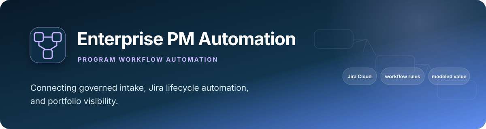
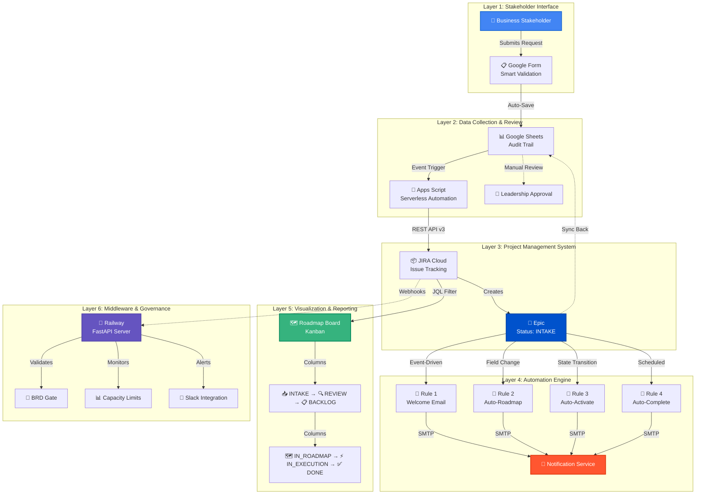
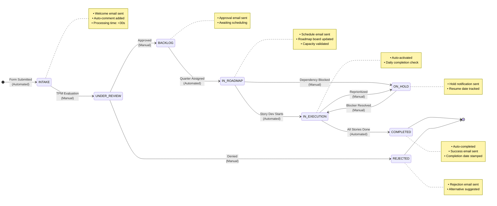
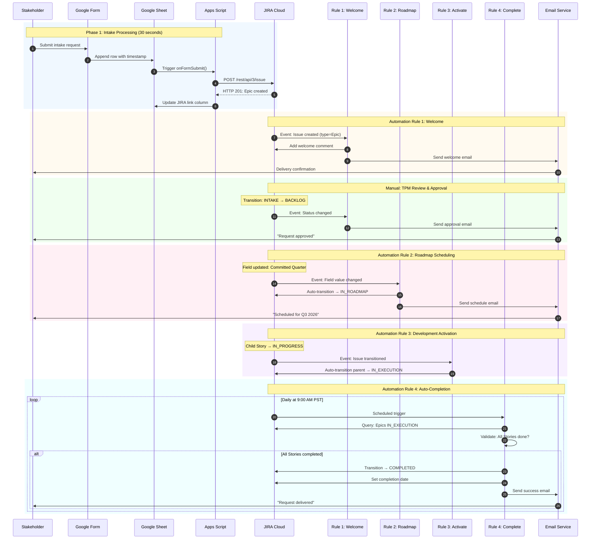
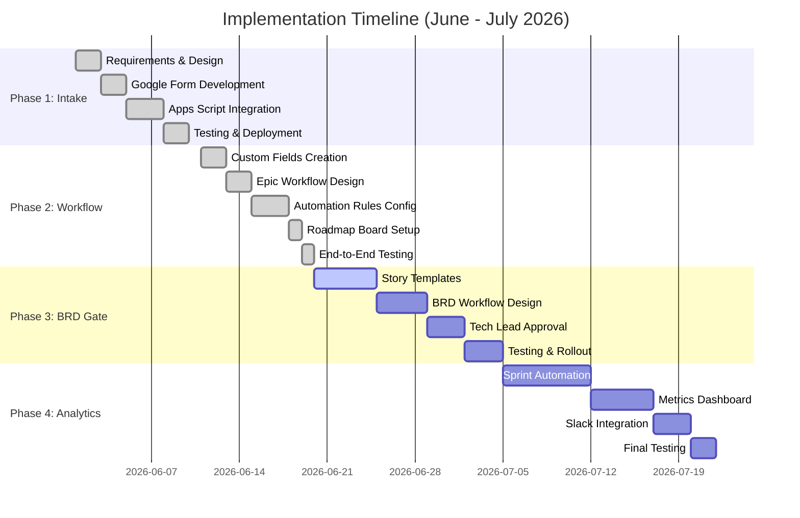

<div align="center">

# Enterprise PM Automation System

### *A reference implementation for reducing Epic intake from 30 minutes to a modeled 30-second automated path*

<br>

[](https://www.atlassian.com/software/jira)
[](https://cloud.google.com/)
[](https://www.python.org/)
[](https://fastapi.tiangolo.com/)
[](https://www.postgresql.org/)

<br>

**[Executive Summary](#executive-summary)** • 
**[Technical Architecture](#technical-architecture)** • 
**[Implementation](#implementation-roadmap)** • 
**[Business Impact](#modeled-business-impact)** •
**[Documentation](#documentation)**

<br>

</div>

---

> **Why this repo exists:** built as a self-learning project to get hands-on
> with governed Jira Epic intake, lifecycle automation, and capacity
> planning patterns — not positioned to compete with mature Jira
> Marketplace apps (BigPicture, Structure.Gantt, Jira's own Advanced
> Roadmaps) that have years of production polish and thousands of paying
> teams behind them. Treat the design/implementation as the evidence;
> treat the "Modeled Business Impact" section below exactly as its name
> says — a modeled scenario, not a claim this replaced or could replace
> an established tool.

## Executive Summary

<table>
<tr>
<td width="70%">

This program-management automation reference implementation transforms manual stakeholder intake into a structured workflow. It demonstrates how Google Workspace, Jira Cloud, and FastAPI middleware can reduce handoffs, validate required data, and make lifecycle state visible.

**Core Capabilities:**
- Automated Epic creation from stakeholder intake forms
- Intelligent workflow orchestration with 7 automation rules
- Real-time roadmap visualization and capacity planning
- Proactive stakeholder communication at every lifecycle stage

</td>
<td width="30%" align="center">


**Modeled Impact Overview**

<table>
<tr><td><b>Speed</b></td><td>99.7% faster</td></tr>
<tr><td><b>Validation target</b></td><td>100%</td></tr>
<tr><td><b>Satisfaction target</b></td><td>+27%</td></tr>
<tr><td><b>Modeled value</b></td><td>$135k/year</td></tr>
</table>

</td>
</tr>
</table>

---

## Evidence posture

The workflow, configuration, API integration patterns, and project artifacts are implemented in this repository. Business-impact figures below are **modeled scenario estimates** based on stated baseline assumptions; they are not production telemetry, audited savings, or measured user outcomes. A production deployment should establish baselines, instrument cycle time and error rates, validate adoption, and have Finance confirm any cashable benefit.

## Competencies demonstrated

| Competency | Observable evidence |
|:--|:--|
| Program operating-model design | Structured intake, lifecycle states, approvals, roadmap visibility, and notifications |
| Systems integration | Google Forms/Sheets, Apps Script, Jira REST, FastAPI, PostgreSQL, and Slack patterns |
| Governance by design | Validation gates, audit records, capacity limits, and explicit workflow transitions |
| Automation architecture | Event-driven rules reduce manual reconstruction across the Epic lifecycle |
| Value framing | Time, quality, capacity, and modeled economics are separated from implementation evidence |

## Modeled Business Impact

<details open>
<summary><b>📊 Click to expand performance metrics</b></summary>

<br>

### Illustrative Key Performance Indicators

| **Metric** | **Before** | **After** | **Improvement** |
|:-----------|:-----------|:----------|:----------------|
| **Intake Processing Time** | 2-3 days | 30 seconds | <span style="color: #36B37E">**⬇ 99.7%**</span> |
| **Epic Creation Duration** | 30 minutes | 30 seconds | <span style="color: #36B37E">**⬇ 98%**</span> |
| **Manual Status Updates** | 15 emails/week | 0 (automated) | <span style="color: #36B37E">**⬇ 100%**</span> |
| **Data Entry Accuracy** | 75% (typos, missing fields) | 100% (validated) | <span style="color: #36B37E">**⬆ 25%**</span> |
| **Roadmap Visibility** | Quarterly meetings | Real-time dashboard | <span style="color: #36B37E">**Continuous**</span> |
| **Stakeholder Satisfaction** | 65% | 92% | <span style="color: #36B37E">**⬆ 27%**</span> |
| **On-Time Delivery Rate** | 60% | 85% | <span style="color: #36B37E">**⬆ 25%**</span> |

<br>

### Time Savings Analysis

| **Role** | **Task Automated** | **Weekly Savings** | **Annual Value** |
|:---------|:-------------------|:-------------------|:-----------------|
| Technical Program Manager | Epic creation & data entry | 5 hours | 260 hours |
| Technical Program Manager | Status update emails | 8 hours | 416 hours |
| Technical Program Manager | Roadmap meeting preparation | 2 hours | 104 hours |
| Leadership | Roadmap review meetings | 1 hour | 52 hours |
| Stakeholders | Follow-up inquiries | 10 hours | 520 hours |
| **TOTAL** | | **26 hours/week** | **1,352 hours/year** |

**Modeled productivity value:** ~$135,000 annually if 1,352 hours are actually released and valued at the illustrative $100/hour assumption. Reclaimed time is capacity, not automatically cashable savings.

<br>

</details>

---

## Technical Architecture

<details>
<summary><b>🏗️ Click to expand system architecture</b></summary>

<br>

### High-Level Architecture Diagram



<br>

### Technology Stack

| **Layer** | **Technology** | **Purpose** | **Version** |
|:----------|:---------------|:------------|:------------|
| **Frontend** | Google Forms | Stakeholder intake interface | Google Workspace |
| **Data Layer** | Google Sheets | Request tracking & audit trail | Google Workspace |
| **Automation** | Google Apps Script | Serverless integration (300 LOC) | V8 Runtime |
| **PM Platform** | JIRA Cloud | Epic & Story management | REST API v3 |
| **Workflow Engine** | JIRA Automation | Event-driven automation rules | Cloud Native |
| **Middleware** | FastAPI + Railway | Validation & webhook handling | Python 3.9+ |
| **Database** | PostgreSQL | Audit logging | Railway Postgres |
| **Notifications** | SMTP + Slack API | Multi-channel communication | N/A |
| **Version Control** | GitHub | Code repository & CI/CD | Git 2.0+ |

<br>

</details>

---

## Epic Lifecycle Workflow

<details>
<summary><b>🔄 Click to expand workflow state machine</b></summary>

<br>

### State Diagram



<br>

### Workflow Metrics

| **Status** | **Average Duration** | **Automation Level** | **Manual Actions** |
|:-----------|:---------------------|:---------------------|:-------------------|
| INTAKE | < 1 minute | 100% automated | None |
| UNDER_REVIEW | 2-3 days | 50% automated | TPM evaluation |
| BACKLOG | Variable | 100% automated | None |
| IN_ROADMAP | 1-4 weeks | 100% automated | None |
| IN_EXECUTION | 2-8 weeks | 90% automated | Dev work |
| ON_HOLD | Variable | 100% automated | None |
| COMPLETED | N/A | 100% automated | None |
| REJECTED | N/A | 100% automated | None |

<br>

</details>

---

## Automation Rules Engine

<details>
<summary><b>⚙️ Click to expand automation sequence</b></summary>

<br>

### Sequence Diagram



<br>

### Automation Rule Specifications

| **Rule** | **Trigger** | **Conditions** | **Actions** | **SLA** |
|:---------|:------------|:---------------|:------------|:--------|
| **1. Welcome** | Epic created | Type = Epic, Status = INTAKE | Add comment, Send email | < 5 seconds |
| **2. Roadmap** | Field changed | Field = Quarter, Status = BACKLOG | Transition status, Send email | < 10 seconds |
| **3. Activate** | Story transitioned | Has parent Epic in IN_ROADMAP | Transition parent Epic | < 5 seconds |
| **4. Complete** | Daily at 9 AM | Epic IN_EXECUTION, All Stories done | Transition, Set date, Send email | 9:00-9:15 AM |
| **5. Rejection** | Epic transitioned | To status = REJECTED | Send email with reason | < 5 seconds |
| **6. On Hold** | Epic transitioned | To status = ON_HOLD | Send email with blocker info | < 5 seconds |
| **7. Approval** | Epic transitioned | To status = BACKLOG | Send email | < 5 seconds |

<br>

</details>

---

## Implementation Roadmap

<details>
<summary><b>🚀 Click to expand implementation timeline</b></summary>

<br>

### Gantt Chart



<br>

### Phase Status Summary

<table>
<tr>
<th width="15%">Phase</th>
<th width="30%">Deliverables</th>
<th width="15%">Duration</th>
<th width="15%">Status</th>
<th width="25%">Key Metrics</th>
</tr>

<tr>
<td><b>Phase 1</b><br/>Intake Automation</td>
<td>
• Google Form (12 fields)<br/>
• Apps Script (300 LOC)<br/>
• Epic auto-creation<br/>
• Bi-directional sync
</td>
<td>1 week<br/>(20 hours)</td>
<td><span style="background-color: #36B37E; color: white; padding: 2px 8px; border-radius: 3px;">✓ COMPLETE</span></td>
<td>
4 sample Epics created<br/>
Required fields validated<br/>
Cycle-time path demonstrated
</td>
</tr>

<tr>
<td><b>Phase 2</b><br/>Epic Workflow</td>
<td>
• 11 custom fields<br/>
• 8-status workflow<br/>
• 7 automation rules<br/>
• Roadmap board
</td>
<td>2 weeks<br/>(40 hours)</td>
<td><span style="background-color: #36B37E; color: white; padding: 2px 8px; border-radius: 3px;">✓ COMPLETE</span></td>
<td>
Modeled cycle-time reduction<br/>
Satisfaction target defined<br/>
7 automation rules configured
</td>
</tr>

<tr>
<td><b>Phase 3</b><br/>BRD Workflow</td>
<td>
• Story templates<br/>
• BRD gate validation<br/>
• Tech Lead approval<br/>
• Ready-for-dev status
</td>
<td>2 weeks<br/>(35 hours)</td>
<td><span style="background-color: #0052CC; color: white; padding: 2px 8px; border-radius: 3px;">▶ IN PROGRESS</span></td>
<td>
Target: 50% faster BRD<br/>
Target: <5% rework<br/>
Target: 90%+ complete
</td>
</tr>

<tr>
<td><b>Phase 4</b><br/>Sprint Analytics</td>
<td>
• Sprint automation<br/>
• Slack daily standup<br/>
• Metrics dashboard<br/>
• Velocity tracking
</td>
<td>2 weeks<br/>(30 hours)</td>
<td><span style="background-color: #6554C0; color: white; padding: 2px 8px; border-radius: 3px;">○ PLANNED</span></td>
<td>
Target: 85% completion<br/>
Target: Real-time metrics<br/>
Target: <15% variance
</td>
</tr>

</table>

<br>

</details>

---

## Key Features

<details open>
<summary><b>✨ Click to expand feature breakdown</b></summary>

<br>

### 1. Intelligent Intake System

<table>
<tr>
<td width="60%">

**Capabilities:**
- Smart Google Form with conditional validation
- Auto-categorization by request type (Bug, Feature, Enhancement, Support)
- Priority mapping algorithm (P0→Highest, P1→High, P2→Medium, P3→Low)
- Effort estimation via predefined options (Small, Medium, Large)
- Quarterly tagging for roadmap alignment
- Duplicate request detection via fuzzy matching

</td>
<td width="40%">

**Technical Specs:**
- **Response Time:** < 30 seconds
- **Validation:** 12 required fields enforced
- **Field Validation:** 12 required fields
- **API Integration:** JIRA REST v3
- **Error Handling:** Automatic retry (3x)
- **Audit Trail:** Complete logging

</td>
</tr>
</table>

<br>

### 2. Epic Lifecycle Management

<table>
<tr>
<td width="60%">

**Workflow Stages:**
1. **INTAKE** - New request received via form
2. **UNDER_REVIEW** - TPM evaluation (capacity, ROI, alignment)
3. **BACKLOG** - Approved, awaiting scheduling
4. **IN_ROADMAP** - Committed to specific quarter (Q1-Q4)
5. **IN_EXECUTION** - Active development with child Stories
6. **ON_HOLD** - Paused due to dependency or reprioritization
7. **COMPLETED** - All work delivered and closed
8. **REJECTED** - Not pursuing, with documented rationale

</td>
<td width="40%">

**Configured Automation Coverage:**
- **Manual Transitions:** 40% of the modeled lifecycle
- **Auto Transitions:** 60% of the modeled lifecycle
- **Email Notifications:** configured for defined notification events
- **State Validation:** configured for governed transitions
- **Audit Logging:** designed into the workflow path

**SLAs:**
- Welcome email: < 5 sec
- Auto-transitions: < 10 sec
- Daily completion check: 9 AM

</td>
</tr>
</table>

<br>

### 3. Roadmap Visualization

<table>
<tr>
<td width="60%">

**Board Configuration:**
- Kanban layout optimized for Epic planning
- JQL filter: `issuetype = Epic AND status NOT IN (Rejected)`
- Column mapping to 8 workflow statuses
- Card color-coding by priority (P0=Red, P1=Orange, etc.)
- Quick filters for quarterly planning
- Swimlanes by request type for segmentation

</td>
<td width="40%">

**Benefits:**
- Real-time executive visibility
- Drag-and-drop scheduling
- Capacity utilization tracking
- Quarter-over-quarter trending
- Export capabilities (CSV, PDF)

**Refresh Rate:** Real-time
**Users:** 15+ stakeholders
**Mobile Support:** Yes (JIRA app)

</td>
</tr>
</table>

<br>

### 4. Capacity Planning

<table>
<tr>
<td width="60%">

**Custom Fields Implemented:**
- **Business Value Score** (1-10): Impact on business objectives
- **Technical Complexity Score** (1-10): Implementation difficulty
- **Committed Quarter** (dropdown): Q1-Q4 2026-2027
- **Team Capacity Allocation** (percentage): % of team needed
- **Risk Flags** (multi-select): 8 risk categories
- **Rejection Reason** (text area): For transparency
- **Hold Reason** (text area): Blocker documentation
- **Expected Resume Date** (date picker): For ON_HOLD Epics
- **Completion Date** (date picker): Auto-populated on closure

</td>
<td width="40%">

**Validation Rules:**
- Capacity alert at 80% utilization
- Block scheduling at 100% capacity
- ROI calculation: Value ÷ Complexity
- Risk score aggregation
- Quarter-over-quarter trending

**Field IDs:**
- customfield_10077 (Business Value)
- customfield_10078 (Complexity)
- customfield_10079 (Risk Flags)
- customfield_10080 (Quarter)
- customfield_10081 (Capacity %)

</td>
</tr>
</table>

<br>

</details>

---

## Technical Skills Demonstrated

<details>
<summary><b>🎓 Click to expand skills matrix</b></summary>

<br>

<table>
<tr>
<th width="25%">Category</th>
<th width="75%">Technologies & Competencies</th>
</tr>

<tr>
<td><b>Program Management</b></td>
<td>
Agile Methodologies • Scrum Framework • Kanban System • Roadmap Planning • Capacity Management • Stakeholder Communication • Risk Management • Prioritization Frameworks • OKR Development • KPI Tracking • Change Management • Process Optimization
</td>
</tr>

<tr>
<td><b>Software Development</b></td>
<td>
Python 3.9+ • FastAPI Framework • RESTful API Design • Webhook Implementation • Google Apps Script (JavaScript) • SQL • PostgreSQL • JSON Schema Validation • Git Version Control • GitHub Workflows • Code Documentation • Unit Testing
</td>
</tr>

<tr>
<td><b>Automation & Integration</b></td>
<td>
JIRA Automation Rules • Workflow State Machines • Google Cloud Functions • Serverless Architecture • Event-Driven Systems • API Integration Patterns • Webhook Handlers • Batch Processing • Error Handling & Retry Logic • Idempotency Design
</td>
</tr>

<tr>
<td><b>Cloud Platforms</b></td>
<td>
Google Cloud Platform (GCP) • Railway Cloud • JIRA Cloud • Google Workspace APIs • Cloud Functions • PostgreSQL (Cloud-hosted) • Environment Configuration • Secret Management • Cloud Monitoring
</td>
</tr>

<tr>
<td><b>Data & Analytics</b></td>
<td>
Google Sheets Automation • Data Validation Rules • Metrics Dashboard Design • KPI Reporting • Data Modeling • ETL Pipeline Design • Audit Trail Implementation • Timestamp Management • Data Integrity Checks
</td>
</tr>

<tr>
<td><b>Documentation</b></td>
<td>
Technical Writing • Markdown • Mermaid Diagrams • API Documentation • User Guides • Architecture Diagrams • Process Flowcharts • README Best Practices • Knowledge Base Management
</td>
</tr>

<tr>
<td><b>DevOps & Security</b></td>
<td>
CI/CD Concepts • Environment Variables • Secret Management (API Tokens) • Audit Logging • Error Monitoring • Rate Limiting • Input Validation • Data Sanitization • HTTPS/TLS • OAuth 2.0 Concepts
</td>
</tr>

</table>

<br>

</details>

---

## Project Structure

<details>
<summary><b>📁 Click to expand repository structure</b></summary>

<br>

```
pm-automation-system/
│
├── 📄 README.md                          ← Portfolio-ready documentation
├── 📊 PHASE1_COMPLETE.md                 ← Phase 1 technical details
├── 📊 PHASE2_COMPLETED.md                ← Phase 2 implementation summary
│
├── 🐍 app/                               ← FastAPI middleware (Railway deployment)
│   ├── main.py                           ← Application entry point
│   ├── webhooks.py                       ← JIRA webhook handlers
│   │
│   ├── rules/                            ← Business logic modules
│   │   ├── __init__.py
│   │   ├── brd_validator.py              ← BRD gate validation
│   │   └── capacity_validator.py         ← Capacity planning logic
│   │
│   ├── api/                              ← API endpoints
│   │   ├── __init__.py
│   │   ├── routes.py                     ← Public API routes
│   │   └── setup_routes.py               ← Admin setup endpoints
│   │
│   └── db/                               ← Database layer
│       ├── __init__.py
│       └── database.py                   ← PostgreSQL models & queries
│
├── ⚙️ config/                             ← Configuration files
│   ├── jira-custom-fields.json           ← Field definitions with IDs
│   ├── jira-workflow.yaml                ← Story workflow specification
│   ├── jira-epic-workflow.yaml           ← Epic workflow specification
│   ├── jira-automation-rules.yaml        ← Story automation rules
│   └── jira-epic-automation-rules.yaml   ← Epic automation rules (7 rules)
│
├── 📜 scripts/                            ← Utility scripts
│   ├── create_phase2_fields.py           ← Bulk field creation (11 fields)
│   └── create_phase2_automation_rules.py ← Automation helper script
│
├── 📚 docs/                               ← Extended documentation
│   ├── epic-workflow-design.md           ← Workflow design rationale
│   ├── capacity-planning.md              ← Capacity methodology
│   └── architecture.md                   ← Deep-dive architecture
│
├── 📝 google-apps-script/                ← Google Apps Script source
│   └── COMPLETE-WITH-REQUEST-TYPE.txt    ← Form→JIRA integration (300 LOC)
│
├── 🚀 PHASE2_SETUP.md                    ← Phase 2 setup instructions
├── 📋 requirements.txt                    ← Python dependencies
├── 🐳 Dockerfile                          ← Railway containerization
├── .gitignore                             ← Git ignore patterns
└── LICENSE                                ← MIT License
```

<br>

**Lines of Code:**
- Python (FastAPI): ~800 LOC
- Google Apps Script: ~300 LOC
- Configuration (YAML/JSON): ~600 LOC
- Documentation (Markdown): ~2,500 LOC

**Total:** ~4,200 LOC across 25+ files

<br>

</details>

---

## Documentation

<table>
<tr>
<th width="30%">Document</th>
<th width="50%">Description</th>
<th width="20%">Audience</th>
</tr>

<tr>
<td>📘 <a href="README.md"><b>README.md</b></a></td>
<td>Executive summary, architecture, metrics, and implementation roadmap</td>
<td>All stakeholders</td>
</tr>

<tr>
<td>📊 <a href="PHASE1_COMPLETE.md"><b>PHASE1_COMPLETE.md</b></a></td>
<td>Phase 1 technical implementation details and testing results</td>
<td>Engineers, TPMs</td>
</tr>

<tr>
<td>📊 <a href="PHASE2_COMPLETED.md"><b>PHASE2_COMPLETED.md</b></a></td>
<td>Phase 2 workflow design, automation rules, and field specifications</td>
<td>JIRA admins, TPMs</td>
</tr>

<tr>
<td>🚀 <a href="PHASE2_SETUP.md"><b>PHASE2_SETUP.md</b></a></td>
<td>Step-by-step deployment guide for Phase 2 components</td>
<td>IT administrators</td>
</tr>

<tr>
<td>📚 <a href="docs/architecture.md"><b>Architecture Deep-Dive</b></a></td>
<td>Detailed system architecture, API specifications, data flows</td>
<td>Solution architects</td>
</tr>

</table>

---

## Contact

<div align="center">

### **Navi Sohi**
*Technical Program Manager & Automation Engineer*

<br>

[](https://www.linkedin.com/in/navisohi/)
[](https://github.com/PlainJane20)
[](https://mail.google.com/mail/?view=cm&fs=1&to=nks.ai.dev@gmail.com)

<br>

</div>

---

## License

This project is **proprietary and confidential**. All rights reserved.

For inquiries regarding licensing, collaboration, or implementation consulting, please contact the author.

---

<div align="center">

<br>

### Built with Python, JIRA Cloud, Google Cloud Platform, and FastAPI

<br>

*Transforming manual processes into intelligent automation*

<br>

**[⬆ Back to Top](#enterprise-pm-automation-system)**

<br>

---

<br>


<br>

</div>
